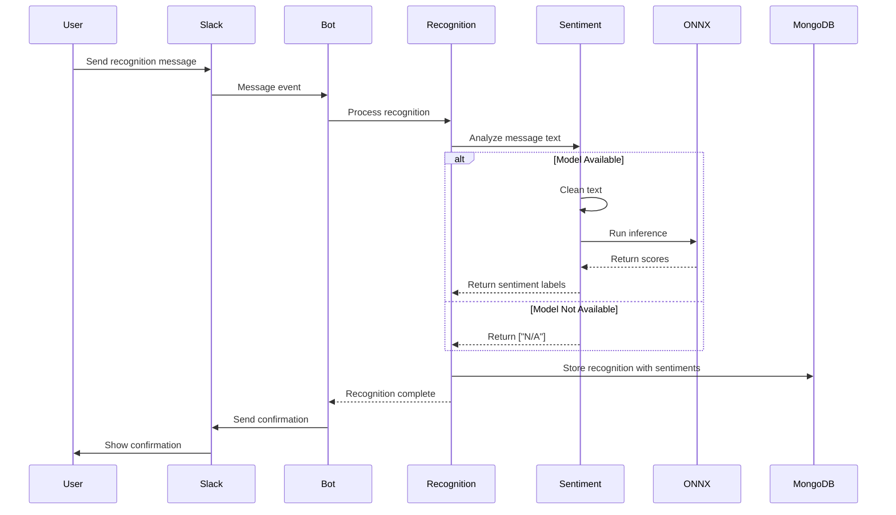

# Sentiment Analysis in Gratibot

## Flow Diagram



## Overview
Gratibot now includes sentiment analysis capabilities to analyze the emotional tone of recognition messages. This feature helps track the nature and impact of recognitions across the organization.

## Implementation Details

### Components

1. **Sentiment Service** (`/service/sentiment.js`)
   - Handles ONNX model loading and inference
   - Provides text preprocessing
   - Manages error cases gracefully

2. **Recognition Integration** (`/service/recognition.js`)
   - Integrates sentiment analysis into the recognition flow
   - Stores sentiment data in the recognition values
   - Handles sentiment analysis failures without disrupting core functionality

### Text Preprocessing

The sentiment analysis service includes several preprocessing steps:
- Removal of URLs
- Removal of Slack-specific formatting (user mentions, channel mentions)
- Removal of emoji codes
- Whitespace normalization

### Error Handling

The system is designed to be resilient:
- If the ONNX model is missing, sentiments are marked as "N/A"
- If sentiment analysis fails, the recognition process continues
- Detailed logging helps track any issues with the sentiment analysis

### Data Storage

Sentiment data is stored in the recognition's values object as:
```javascript
{
  sentiments: string[]  // Array of sentiment labels
}
```

## Setup

1. Create a `/models` directory in the project root if it doesn't exist
2. Place your ONNX sentiment analysis model as `sentiment.onnx` in the `/models` directory
3. The model will be loaded automatically when needed

## Logging

The sentiment analysis service includes comprehensive logging:
- Model loading status
- Text preprocessing details
- Analysis results
- Any errors that occur during processing

Logs can be viewed in the standard application logs with the following contexts:
- `service.sentiment.initModel`
- `service.sentiment.analyzeSentiment`
